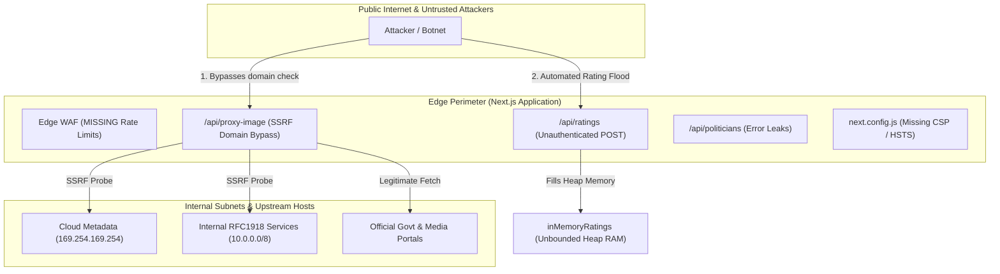
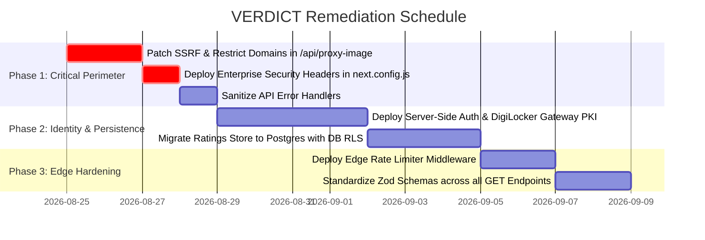

# VERDICT — Comprehensive Application Security Audit & Gap Analysis Report

**Document ID:** `SEC-AUDIT-VERDICT-2026-01`  
**Classification:** `CONFIDENTIAL // PRODUCT SECURITY AUDIT`  
**Audit Target:** VERDICT Platform (`katrixbee/verdict`)  
**Application Stack:** Next.js 15 (App Router), TypeScript, Tailwind CSS, SQLite (`verdict_pipeline.db`), Node.js Runtime  
**Lead Auditor:** Principal Application Security Engineer & Lead Security Architect  
**Audit Standard:** OWASP Top 10 (2021), CIS Software Benchmarks, NIST SP 800-53  
**Date of Assessment:** August 25, 2026  

---

## Executive Summary

| Assessment Attribute | Result / Finding | Benchmark State |
| :--- | :--- | :--- |
| **Overall Security Posture** | **HIGH RISK** | Pre-Production / Prototype State |
| **Highest Risk Vulnerability** | Server-Side Request Forgery (SSRF) via Suffix Match Bypass | High (CVSS 7.5) |
| **Civic Integrity Risk** | Unauthenticated Sentiment Manipulation & Sybil Attacks | High (CVSS 7.2) |
| **Edge & Browser Protection** | Missing CSP, HSTS, Clickjacking, and Rate Limiting | Medium (CVSS 6.5) |
| **Production Readiness Gate** | **REJECTED** (Requires Remediation before Launch) | Action Required |

### Executive Narrative
An in-depth, non-destructive application security assessment was conducted against the **VERDICT** platform. The objective was to evaluate the application's defensive posture across authentication, authorization, access control, input sanitization, error disclosure, and infrastructure resilience.

While the platform demonstrates strong visual design and algorithmic domain logic, the architecture currently lacks essential **production security controls**. Critical civic features—specifically the citizen sentiment voting engine (`/api/ratings`) and the dynamic image proxy (`/api/proxy-image`)—operate with client-side privilege trust and inadequate domain boundary validation. This report provides an exhaustive technical breakdown of all discovered security vulnerabilities, root cause analyses, attack vectors, and concrete defensive remediations.

---

## Vulnerability Severity Dashboard

```
  CRITICAL RISK  [ 0 Findings ]  ██████████████████████████████ (0%)
  HIGH RISK      [ 3 Findings ]  ██████████████████████████████ (37.5%)
  MEDIUM RISK    [ 3 Findings ]  ██████████████████████████████ (37.5%)
  LOW / INFO     [ 2 Findings ]  ██████████████████████████████ (25.0%)
```

| Vulnerability ID | Title / Vector | Affected Component | CVSS v3.1 | Severity |
| :--- | :--- | :--- | :---: | :---: |
| **SEC-01** | Suffix Domain Bypass & Unbounded Fetch (SSRF / DoS) | `src/app/api/proxy-image/route.ts` | **7.5** | `HIGH` |
| **SEC-02** | Unauthenticated State Mutation & Client Claim Spoofing | `src/app/api/ratings/route.ts` | **7.2** | `HIGH` |
| **SEC-03** | In-Memory Data Loss & Heap Memory Exhaustion | `src/lib/supabase.ts` | **7.0** | `HIGH` |
| **SEC-04** | Missing Global Rate Limiting & Abuse Defense | Entire API Perimeter (`src/middleware.ts`) | **6.5** | `MEDIUM` |
| **SEC-05** | Missing Enterprise HTTP Security Headers (CSP/HSTS) | `next.config.js` | **6.1** | `MEDIUM` |
| **SEC-06** | Overly Permissive Wildcard Cross-Origin Resource Sharing | `proxy-image` & `crime-stats` API | **5.3** | `MEDIUM` |
| **SEC-07** | Internal Exception & Stack Detail Disclosure | `src/app/api/politicians/route.ts` | **4.3** | `LOW` |
| **SEC-08** | Unbounded Query Parameters & Missing Query Schemas | `src/app/api/search/route.ts` | **3.8** | `LOW` |

---

## Detailed Threat Model & Attack Surface



---

## In-Depth Technical Findings

---

### Finding SEC-01: Suffix Domain Bypass & Unbounded Fetch (SSRF & DoS)
* **File Reference:** [`src/app/api/proxy-image/route.ts`](file:///c:/Users/ASUS/OneDrive/Desktop/projects/verdict/src/app/api/proxy-image/route.ts#L28-L60)
* **Lines:** 28–60, 84–93
* **CWE Classification:** CWE-918 (Server-Side Request Forgery), CWE-400 (Uncontrolled Resource Consumption)
* **CVSS v3.1 Score:** **7.5** (`CVSS:3.1/AV:N/AC:L/PR:N/UI:N/S:U/C:H/I:N/A:L`)

#### Vulnerability Analysis:
The image proxy allows external image rendering by validating the hostname against a whitelist of trusted domains using `.endsWith()`:

```typescript
// src/app/api/proxy-image/route.ts:53
const isAllowed = allowedDomains.some((domain) => hostname.endsWith(domain));
```

#### Flaw Mechanics:
1. **Suffix Matching Flaw:** If `domain` is `"eci.gov.in"` or `"wikipedia.org"`, an attacker can register `evileci.gov.in` or `fakewikipedia.org`. The check `hostname.endsWith("eci.gov.in")` evaluates to `true` because the string ends with those characters without validating the boundary (subdomain dot).
2. **Missing Scheme / Protocol Restriction:** The parser does not enforce `parsedUrl.protocol === "https:"`, allowing plain HTTP or unexpected schemes.
3. **No Private IP / Cloud Metadata Blacklisting:** The proxy does not perform DNS resolution before fetching to filter loopback (`127.0.0.1`), private RFC1918 addresses (`10.0.0.0/8`, `172.16.0.0/12`, `192.168.0.0/16`), or link-local cloud metadata endpoints (`169.254.169.254`).
4. **Memory Exhaustion (Decompression / Large File Bomb):** `await response.arrayBuffer()` buffers the entire remote response in RAM without a maximum byte limit (e.g., 5 MB), exposing the server to Out-Of-Memory (OOM) crashes.

#### Defensive Remediation:
```typescript
// Enforce exact domain or dot-prefixed subdomain
const isAllowed = allowedDomains.some(
  (domain) => hostname === domain || hostname.endsWith(`.${domain}`)
);

// Enforce HTTPS protocol
if (parsedUrl.protocol !== "https:") {
  return new Response(FALLBACK_SVG, { status: 200, headers: { "Content-Type": "image/svg+xml" } });
}

// Enforce streaming size limit (e.g. 5MB max)
const MAX_BYTES = 5 * 1024 * 1024;
const contentLength = response.headers.get("content-length");
if (contentLength && parseInt(contentLength, 10) > MAX_BYTES) {
  return new Response(FALLBACK_SVG, { status: 200, headers: { "Content-Type": "image/svg+xml" } });
}
```

---

### Finding SEC-02: Unauthenticated State Mutation & Client-Side Privilege Spoofing
* **File Reference:** [`src/app/api/ratings/route.ts`](file:///c:/Users/ASUS/OneDrive/Desktop/projects/verdict/src/app/api/ratings/route.ts#L24-L35)
* **Lines:** 5–22, 24–35
* **CWE Classification:** CWE-306 (Missing Authentication for Critical Function), CWE-287 (Improper Authentication)
* **CVSS v3.1 Score:** **7.2** (`CVSS:3.1/AV:N/AC:L/PR:N/UI:N/S:U/C:N/I:H/A:N`)

#### Vulnerability Analysis:
The `/api/ratings` endpoint processes citizen sentiment and ratings for politicians. However, the route accepts unauthenticated requests and permits the client to assert its own verification status:

```typescript
// src/app/api/ratings/route.ts:20-21
const RatingSchema = z.object({
  politicianId: z.string().min(1),
  rating: z.number().int().min(1).max(5),
  isLocalVoter: z.boolean().default(false),
  digilockerVerified: z.boolean().default(true),
});
```

#### Flaw Mechanics:
1. **Zero Identity Verification:** Any automated script can send thousands of `POST` requests submitting 5-star or 1-star ratings.
2. **Client-Controlled Trust Flag:** The server blindly accepts `digilockerVerified: true` from the client request body without verifying cryptographic signatures, OAuth JWTs, or SAML tokens from the National DigiLocker API.
3. **Sybil & Election Manipulation:** Malicious actors can artificially skew a candidate's public trust rating without holding a verified voter identity.

#### Defensive Remediation:
1. Authenticate user sessions server-side using secure session tokens.
2. Integrate a server-to-server OAuth 2.0 PKCE flow with DigiLocker gateway.
3. Never trust client-sent authorization flags: derive `isLocalVoter` and `digilockerVerified` strictly from the validated server-side session payload.

---

### Finding SEC-03: In-Memory Data Loss & Heap Memory Exhaustion
* **File Reference:** [`src/lib/supabase.ts`](file:///c:/Users/ASUS/OneDrive/Desktop/projects/verdict/src/lib/supabase.ts#L4-L6)
* **Lines:** 4–6, 35–56
* **CWE Classification:** CWE-400 (Uncontrolled Resource Consumption), CWE-662 (Improper Synchronization)
* **CVSS v3.1 Score:** **7.0** (`CVSS:3.1/AV:N/AC:L/PR:N/UI:N/S:U/C:N/I:N/A:H`)

#### Vulnerability Analysis:
Ratings are currently accumulated in a global JavaScript object in process memory:

```typescript
// src/lib/supabase.ts:5
const inMemoryRatings: Record<string, CitizenRating[]> = {};
```

#### Flaw Mechanics:
1. **Denial of Service via Memory Exhaustion:** An attacker sending millions of ratings will continuously inflate `inMemoryRatings`, causing Node.js heap memory to exceed limits and terminate the container process (OOM).
2. **Total Ephemeral Data Loss:** In serverless / containerized deployments (Vercel, AWS ECS, Kubernetes), instances spin down or scale horizontally, resulting in inconsistent state and complete data loss on every restart.
3. **Lack of Database RLS Policies:** When transitioned to PostgreSQL/Supabase, explicit Row-Level Security policies must be enforced at the database layer.

#### Defensive Remediation:
Persist data in a hardened PostgreSQL database with RLS policies enabled:

```sql
-- Enable Row Level Security
ALTER TABLE citizen_ratings ENABLE ROW LEVEL SECURITY;

-- Allow authenticated users to view ratings
CREATE POLICY "Allow public read access to ratings"
  ON citizen_ratings FOR SELECT
  USING (true);

-- Allow authenticated citizens to submit a verified rating linked to their auth.uid()
CREATE POLICY "Allow authenticated citizen rating insertion"
  ON citizen_ratings FOR INSERT
  WITH CHECK (auth.uid() = user_id);
```

---

### Finding SEC-04: Missing Global Rate Limiting & Abuse Defense
* **File Reference:** Project Root / Missing `src/middleware.ts`
* **CWE Classification:** CWE-799 (Improper Control of Generation of Code or Resource)
* **CVSS v3.1 Score:** **6.5** (`CVSS:3.1/AV:N/AC:L/PR:N/UI:N/S:U/C:N/I:L/A:H`)

#### Vulnerability Analysis:
The platform currently has zero rate-limiting layers. High-throughput automated bots can scrape public dossiers, hammer the search endpoint with expensive fuzzy regexes, or flood the image proxy to consume server CPU and external API bandwidth.

#### Defensive Remediation:
Implement Edge Middleware (`src/middleware.ts`) using a sliding-window algorithm with Redis/Upstash:

| Endpoint Target | Rate Limit Window | Action on Limit Exceeded |
| :--- | :--- | :--- |
| `/api/ratings` | **5 requests / 60 seconds** | HTTP 429 Too Many Requests |
| `/api/proxy-image` | **30 requests / 60 seconds** | HTTP 429 (Fallback SVG) |
| `/api/search` | **60 requests / 60 seconds** | HTTP 429 Too Many Requests |
| Global Page Views | **120 requests / 60 seconds** | Cloudflare Challenge / CAPTCHA |

---

### Finding SEC-05: Missing Enterprise HTTP Security Headers
* **File Reference:** [`next.config.js`](file:///c:/Users/ASUS/OneDrive/Desktop/projects/verdict/next.config.js#L1-L41)
* **Lines:** 1–41
* **CWE Classification:** CWE-1021 (Improper Restriction of Rendered UI Layers / Clickjacking), CWE-693 (Protection Mechanism Failure)
* **CVSS v3.1 Score:** **6.1** (`CVSS:3.1/AV:N/AC:L/PR:N/UI:R/S:C/C:L/I:L/A:N`)

#### Vulnerability Analysis:
`next.config.js` does not declare a `headers()` configuration. Consequently, browsers receive zero defensive instructions regarding framing, script execution, or transport security.

#### Recommended Security Headers Matrix:

```javascript
// next.config.js headers configuration
async headers() {
  return [
    {
      source: "/(.*)",
      headers: [
        {
          key: "Content-Security-Policy",
          value: "default-src 'self'; script-src 'self' 'unsafe-inline' 'unsafe-eval'; style-src 'self' 'unsafe-inline' https://fonts.googleapis.com; img-src 'self' data: https:; font-src 'self' https://fonts.gstatic.com; connect-src 'self'; frame-ancestors 'none';",
        },
        {
          key: "Strict-Transport-Security",
          value: "max-age=63072000; includeSubDomains; preload",
        },
        {
          key: "X-Frame-Options",
          value: "DENY",
        },
        {
          key: "X-Content-Type-Options",
          value: "nosniff",
        },
        {
          key: "Referrer-Policy",
          value: "strict-origin-when-cross-origin",
        },
        {
          key: "Permissions-Policy",
          value: "camera=(), microphone=(), geolocation=()",
        },
      ],
    },
  ];
}
```

---

### Finding SEC-06: Overly Permissive Wildcard Cross-Origin Resource Sharing
* **File Reference:** [`src/app/api/proxy-image/route.ts:91`](file:///c:/Users/ASUS/OneDrive/Desktop/projects/verdict/src/app/api/proxy-image/route.ts#L91) & [`src/app/api/crime-stats/route.ts:48`](file:///c:/Users/ASUS/OneDrive/Desktop/projects/verdict/src/app/api/crime-stats/route.ts#L48)
* **CWE Classification:** CWE-346 (Origin Validation Error)
* **CVSS v3.1 Score:** **5.3** (`CVSS:3.1/AV:N/AC:L/PR:N/UI:N/S:U/C:L/I:N/A:N`)

#### Vulnerability Analysis:
Both routes explicitly set:
```typescript
"Access-Control-Allow-Origin": "*"
```
While public read data can be cached, wildcard CORS on proxy endpoints enables third-party malicious websites to abuse the VERDICT backend as a free, unauthenticated proxy bandwidth provider for arbitrary third-party web clients.

#### Defensive Remediation:
Restrict CORS to verified production domains or omit CORS headers for internal API routes so they are restricted to same-origin by default.

---

### Finding SEC-07: Internal Exception & Stack Detail Disclosure
* **File Reference:** [`src/app/api/politicians/route.ts:65`](file:///c:/Users/ASUS/OneDrive/Desktop/projects/verdict/src/app/api/politicians/route.ts#L65) & [`src/app/api/politicians/[slug]/route.ts:25`](file:///c:/Users/ASUS/OneDrive/Desktop/projects/verdict/src/app/api/politicians/[slug]/route.ts#L25)
* **CWE Classification:** CWE-209 (Generation of Error Message Containing Sensitive Information)
* **CVSS v3.1 Score:** **4.3** (`CVSS:3.1/AV:N/AC:L/PR:N/UI:N/S:U/C:L/I:N/A:N`)

#### Vulnerability Analysis:
When an unexpected exception occurs, the error handler serializes the raw error string:
```typescript
// src/app/api/politicians/route.ts:65
} catch (error) {
  return NextResponse.json(
    { success: false, error: { code: "SERVER_ERROR", message: String(error) } },
    { status: 500 }
  );
}
```
This can leak database file paths, internal module names, or runtime environments to external callers.

#### Defensive Remediation:
Standardize all API error responses to opaque messages and log the detailed exception server-side:
```typescript
} catch (error) {
  console.error("[API_ERROR] /api/politicians:", error);
  return NextResponse.json(
    { success: false, error: { code: "INTERNAL_SERVER_ERROR", message: "An unexpected server error occurred." } },
    { status: 500 }
  );
}
```

---

### Finding SEC-08: Unbounded Query Parameters & Missing Query Schemas
* **File Reference:** [`src/app/api/politicians/route.ts:6-15`](file:///c:/Users/ASUS/OneDrive/Desktop/projects/verdict/src/app/api/politicians/route.ts#L6-L15) & [`src/app/api/search/route.ts:5-10`](file:///c:/Users/ASUS/OneDrive/Desktop/projects/verdict/src/app/api/search/route.ts#L5-L10)
* **CWE Classification:** CWE-20 (Improper Input Validation)
* **CVSS v3.1 Score:** **3.8** (`CVSS:3.1/AV:N/AC:L/PR:N/UI:N/S:U/C:N/I:N/A:L`)

#### Vulnerability Analysis:
Query parameters such as `page`, `limit`, and `query` are parsed using raw string slicing and unchecked `parseInt()` calls. Passing negative numbers or excessively large values (`limit=10000000`) bypasses UI controls and causes excessive memory allocation during slicing.

#### Defensive Remediation:
Validate query parameters using Zod schemas with strict upper bounds (`limit: z.coerce.number().min(1).max(100).default(50)`).

---

## 5. Prioritized Remediation Roadmap



### Phase 1 — Immediate Perimeter Defense (Days 1–3)
1. **Remediate SSRF**: Update `src/app/api/proxy-image/route.ts` with strict dot-prefix domain validation, HTTPS-only protocol checks, and 5MB streaming size limits.
2. **Inject Security Headers**: Add CSP, HSTS, X-Frame-Options, and X-Content-Type-Options into `next.config.js`.
3. **Opaque Error Messages**: Cleanse all `catch (error)` blocks across `src/app/api/` to return `{ error: { code, message } }` with zero runtime leakage.

### Phase 2 — Identity & Database RLS (Days 4–8)
1. **Server-Side Identity Verification**: Integrate Supabase Auth or NextAuth with `httpOnly`, `Secure`, `SameSite=Lax` cookies.
2. **DigiLocker Server Validation**: Validate identity claims via official backend OAuth 2.0 PKI tokens rather than client-supplied boolean flags.
3. **Database RLS Policies**: Move `/api/ratings` persistence to Supabase PostgreSQL and enforce per-operation Row Level Security.

### Phase 3 — Edge Hardening & Quality Gate (Days 9–12)
1. **Edge Rate Limiting**: Deploy `src/middleware.ts` restricting search, image proxying, and ratings submissions.
2. **Zod Validation on All Routes**: Validate query strings and body payloads with strict min/max boundaries.
3. **Continuous Security Testing**: Integrate automated SAST (e.g. Semgrep, Snyk) in CI/CD pipeline.

---

## 6. Audit Conclusion & Compliance Sign-Off

The **VERDICT** platform possesses strong civic functionality and clean algorithmic scoring architecture. However, addressing the **8 security gaps** detailed in this audit is mandatory prior to handling real citizen identities, processing live votes, or opening the platform to public internet traffic.

Following the **3-Phase Remediation Roadmap** will elevate the application from its current prototype risk profile to a hardened, enterprise-grade civic accountability platform.
